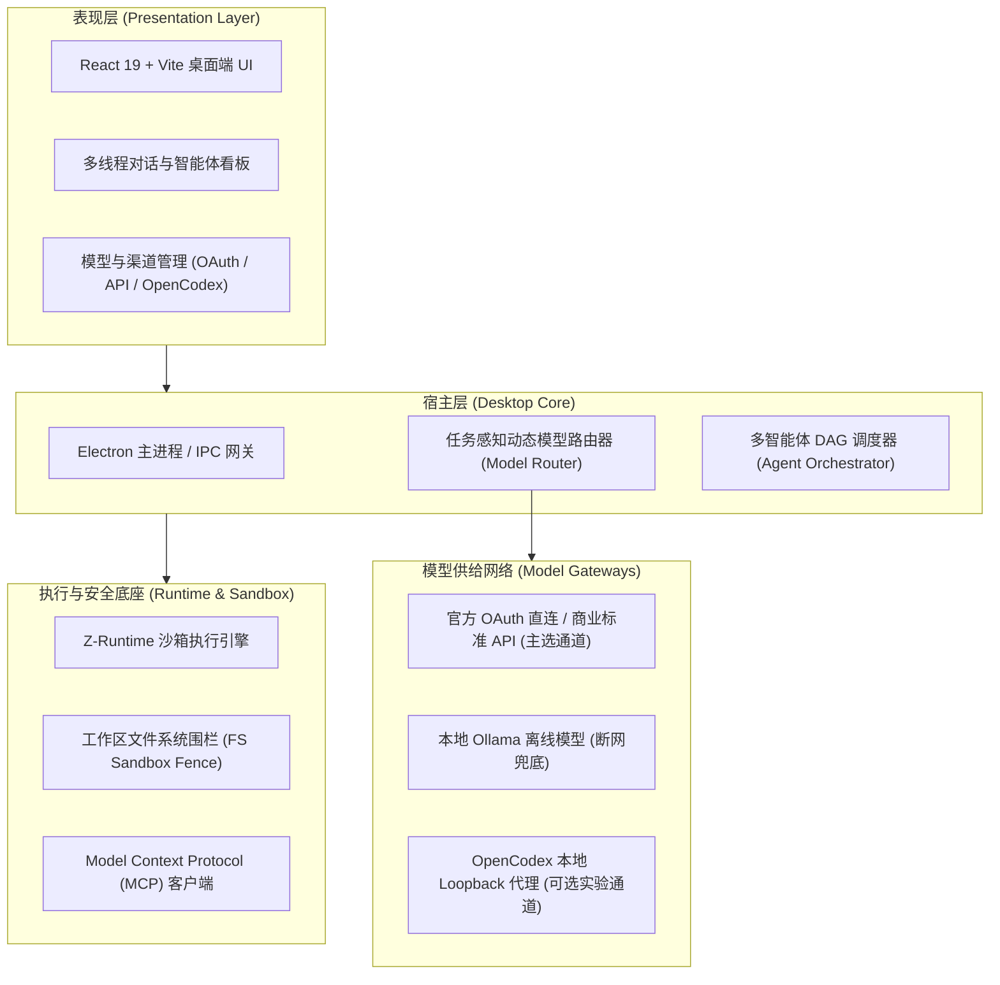

# TaskWeaver Desktop

<div align="center">

**任务感知动态模型路由的多智能体协作编程桌面应用**  
*(Task-Aware Dynamic Model Routing Multi-Agent Programming Desktop IDE)*

[](LICENSE)
[](https://www.electronjs.org/)
[](https://react.dev/)
[](https://www.typescriptlang.org/)

</div>

---

## 📖 项目概览 (Overview)

**TaskWeaver** 是一款面向现代软件工程研发场景的多智能体协同编程桌面环境。系统以“**任务感知、智能分工、成本可控、确定性执行**”为核心设计原则，在统一的桌面交互界面中集成了多智能体编排调度器（Master / Plan / Coder / Reviewer / Terminal）、原生安全沙箱执行引擎以及任务感知动态模型路由机制。

本项目为计算机科学与技术专业毕业设计核心研发成果。

---

## ✨ 核心特性 (Key Features)

1. **任务感知动态模型路由 (Task-Aware Dynamic Model Routing)**
   - 根据当前交互轮次所处的任务类型（架构规划、复杂编码、快速补全、代码审查、测试排错），实时评估各模型的性能、延迟与价签成本；
   - 动态调度最优模型（如规划优先 DeepSeek-R1 / Claude 3.7 Sonnet，极速响应优先轻量级模型）；
   - 支持跨厂商路由容灾熔断与本地 Ollama 离线回退。

2. **多智能体协同流水线 (Multi-Agent Orchestration)**
   - **主控 Agent (Master)**：统筹任务边界、分解复杂需求；
   - **执行子智能体 (Worker Agents)**：按拓扑 DAG 并行或串行执行代码编写、静态诊断、单测执行；
   - **审查与验证智能体 (Reviewer & Verifier)**：自动化差异核对与安全策略拦截。

3. **确定性运行时与安全沙箱 (Deterministic Sandbox & Z-Runtime)**
   - 本地内嵌安全沙箱执行层（Z-Runtime），实现工作区文件围栏（FS Fence）与命令审批流（Permission Prompt Bridge）；
   - 支持 Git 检查点（Git Checkpoints）与快照自动回滚，保障代码修改绝对安全。

4. **开放生态与多协议兼容 (Open Protocol & Tool Ecosystem)**
   - 官方直连 OAuth 与主流商业大模型 API（DeepSeek, OpenAI, Anthropic, OpenRouter, SiliconFlow 等）；
   - 原生支持 **Model Context Protocol (MCP)** 标准协议，可无缝接入外部 MCP Client 与 Server 工具生态；
   - 内置可选的本地 OpenCodex 代理网关，提供实验性的模型协议转换支持。

---

## 🏛️ 系统架构 (Architecture)



---

## 🚀 快速上手 (Quick Start)

### 环境要求
- **Node.js** >= 18.0.0
- **npm** >= 9.0.0
- 支持系统：macOS (Apple Silicon / Intel), Linux, Windows

### 安装与运行

```bash
# 1. 克隆代码仓库
git clone <repository-url>
cd <project-root>

# 2. 安装依赖 (自动建立 vendor/opencodex 的本地链接)
npm install

# 3. 启动开发模式 (Vite Web + Electron)
npm run dev

# 4. 构建桌面端打包产物
npm run build
npm run app:dmg      # macOS DMG 打包
```

### 契约与单元测试

```bash
# 运行全部守卫测试
npm run test:all

# 运行 OpenCodex 分叉契约与白名单测试
npm run test:opencodex-fork

# 运行在线/离线基线差异对比
npm run test:opencodex-upstream
```

---

## 🙏 上游致谢与开源致意 (Acknowledgements)

TaskWeaver 的研发离不开广阔开源社区的基石工作，在此特别向以下优秀的开源项目、团队与协议规范致谢：

* **[OpenCodex](https://github.com/lidge-jun/opencodex)** (`@bitkyc08/opencodex`)：感谢作者及贡献者在本地模型代理协议转换领域的开源探索；
* **[Model Context Protocol (MCP)](https://github.com/modelcontextprotocol)**：由 Anthropic 开源的标准工具上下文协议；
* **[BurntSushi/ripgrep](https://github.com/BurntSushi/ripgrep)**：极速的跨平台文本搜索基础设施；
* **[Electron](https://www.electronjs.org/) & [React](https://react.dev/)**：成熟稳定的跨平台桌面应用与响应式 UI 体系；
* **模型提供商**：[DeepSeek](https://www.deepseek.com/)、[Anthropic](https://www.anthropic.com/)、[OpenAI](https://openai.com/)、[OpenRouter](https://openrouter.ai/) 等为人工智能编程生态提供的 API 接口服务。

---

## ⚖️ 服务条款 (ToS)、合规与隐私保护声明 (Compliance & Privacy)

### 1. 毕业设计与学术研究定位
本系统为计算机科学与技术专业毕业设计的技术成果，旨在探索任务感知的模型动态调度策略、多智能体协同流水线与安全沙箱执行机制。

### 2. 逆向协议通道使用界限 (OpenCodex / Cursor)
* **本地研发与学术对比限定**：项目中集成的 OpenCodex 及 Cursor 逆向协议适配模块，**仅供个人开发者在本地 Loopback (`127.0.0.1`) 环境下进行学术研究、技术验证与延迟/成本横向对比**；
* **自主授权与合规边界**：涉及第三方平台账号的操作均须使用者在本地浏览器中通过其官方登录界面自主授权，TaskWeaver 不提供也不包含任何绕过身份验证的破解代码；
* **服务条款与风险自担**：第三方平台可能随时调整其服务条款 (ToS)、频率限制或封禁非官方客户端接入。用户须自行遵守相关平台的服务条款，因使用逆向协议通道导致的调用受限、账号风控等后果均由使用者自行承担。

### 3. 正式推荐通道
* **TaskWeaver 官方正式推荐通道为「官方 OAuth 直连」与「标准商业 API Key」**（如 DeepSeek、Claude、OpenAI、OpenRouter 等）；
* 生产使用、商业部署与正式学术演示建议均基于官方正式接口，以确保服务的长期稳定性、高可用性与商业合规。

### 4. 隐私安全承诺与零私有数据窃取
* **零私有数据窃取**：TaskWeaver **绝不读取、不窃听、不上传**用户宿主环境中的私有凭据、个人密码、系统密钥或第三方应用的专有会话数据；
* **凭据本地加密存储**：所有用户填写的 API Key 与本地认证 Token 均存储于本地安全存储中，绝不进行任何外部网络回传；
* **软隔离容灾设计**：所有渠道在架构层面实现严格解耦。可选实验通道未启动、端口冲突或协议失效时，**绝不影响其他已配置模型通道的正常使用**，确保系统始终具备高韧性。
