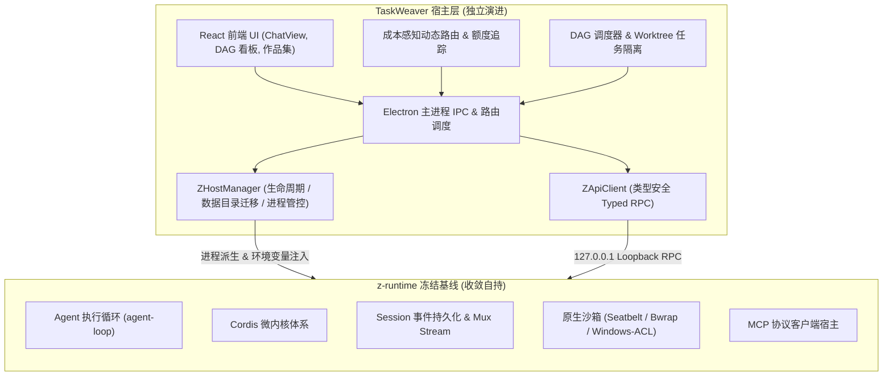

# DSH 对齐与 TaskWeaver 差异化

对照参考实现：`/Users/zsn/Documents/deepseek/dsh-source`（DeepSeek Host / DSH）。  
本文说明**已对齐**、**刻意保留的个性化能力**，以及**后续可继续收敛**的项。

## 上游依赖消除与自持基线声明（阶段 1.4）

> **正式声明**：阶段 A 后不再合并上游 DSH，`vendor/z-runtime` 为冻结自有基线，许可证与致谢据实标注。

### 1. 冻结自持决策与背景
1. **架构解耦要求**：上游 DSH 保持自身单体演进（包含 Web UI、特定 Cordis 插件组织方式及外部上游变动）。TaskWeaver 核心价值在于桌面级多 Agent DAG 编排、成本感知模型路由、Task Worktree 隔离与原生 Electron 工具集成。长期跟随上游合并不仅维护成本极高，且频繁引入破坏性改动。
2. **源码基线冻结**：完成阶段 A 剔除外部源码目录（`dsh-source`）后，TaskWeaver 彻底转为**单一受控基线**。以 `vendor/z-runtime` 为自持根目录，不再跟踪、拉取或合并上游任何新分支与 commit。
3. **开源许可与合规致谢**：
   - 严格保留原始代码中的 MIT License 及作者版权头（`@deepseek-ai` / 原始贡献者）；
   - 在应用设置页及工程文档中明确据实标注对上游 DeepSeek Harness 原型研究成果的致谢与技术溯源；
   - TaskWeaver 自身新增与重构模块享有独立著作权与代码治理权。

### 2. 冻结自持与二次开发的架构边界

| 层次维度 | 冻结基线 (`vendor/z-runtime`) | TaskWeaver 自研/二次开发层 |
|---------|------------------------------|--------------------------|
| **控制主权** | 冻结在可用基线版本，仅做去 DSH 命名收敛与稳定性 Bug 修复 | 拥有完全演进主权，持续扩展新功能 |
| **会话模型** | 单 Session 的 Agent turn 循环与底层事件持久化 | 多会话树调度、DAG 跨任务协同、Thread 元数据统一持久化 |
| **模型网关** | 依赖本地 ApiProxy 与统一模型描述 | 成本感知路由作品集、动态加权策略、OpenCodex / 本地退路代理集成 |
| **沙箱与安全**| 提供 `read-only` / `workspace-write` 等策略接口与原生 Runner | 启发式审批机制 (`on-risk`)、规则表匹配、工作区越界防护拦截 |
| **环境与存储**| 消费 `Z_HOME`（兼容回退 `DSH_HOME`）单根用户数据目录 | 负责桌面级数据目录原子软链、配置迁移、备份与环境探测 |

## v1.2.0 收口（2026-10-07）

- **执行层**：TaskWeaver 已以仓库内 `vendor/z-runtime` 的 DSH Host 为会话执行基线；桌面端通过 `dsh-chat-service.mjs` 维护 conversation/session 映射，并以 Host 事件与 projection 驱动流式状态。UI thread store 仍承担线程元数据和可恢复展示状态，单源迁移审计继续进行中。
- **模型入口**：OpenCodex 以 optional dependency 接入；设置卡检查代理健康与最低版本，代理未就绪时阻止 Cursor 系模型请求。Cursor 专属工具使用提示只对识别出的 Cursor/OpenCodex 模型注入。
- **上下文预算**：每轮额外注入默认硬顶 32 KiB（暂定防护上限，非宣称最优；设置可调 1–128 KiB），Composer 展示字节数与近似 token 数。普通问候不触发业务指引；代码库地图只在首轮工程请求（或首轮 plan/goal）生成，显式 `@file` / `@dir` 内容仍走工作区边界与字节限制。
- **发布边界**：当前工作区的 `taskweaver-optimized` preset 已通过本地 Z Host + 确定性 fake-provider 的原生 grep smoke，但 preset 与测试仍是未提交实验，未纳入 v1.2.0；生产路由继续使用 Host 的 `standard`。真实 MiMo 样本仍出现 ripgrep 启动失败，不能据确定性 smoke 宣称真实任务已无问题。此版本不代表 parity-bench 已进入 CI，也不代表已达到 Host 开销 +15% 的性能目标；配对性能数据仍需补齐。

## 已对齐（行为 / UI）

| 领域 | DSH | TaskWeaver |
|------|-----|------------|
| 多会话并行 | 每 Session 独立 Agent / turn 链 | DSH-backed `dsh-chat-service.mjs` + `orchestration-service.mjs` 按 `conversationId` 隔离流 |
| Worktree 隔离 | （产品层无同等能力） | `worktree-service.mjs` 按 `conversationId/taskId` 路径 + IPC 过滤 |
| 纠偏 / 排队 | Enter 忙时默认 **queue**；纠偏在**会话尾**气泡；QueueDock 仅 follow-up | 默认 `followUp`；`PendingSteeringBubble` + `QueueDock` 只显示排队追问 |
| Think 展示 | ReasoningRow 折叠 | `DshThinkBlock.tsx` + `reasoning-heuristics.ts` |
| Composer 统计 | StatsLine + ContextMeter | `ComposerStatsDock.tsx` + `context-breakdown.mjs` |
| 沙箱 | `dsh-sandbox` | `electron/vendor/dsh-sandbox` + `sandbox-service.mjs` |
| MCP 工具名 | `mcp__<server>__<tool>` | `mcp-service.mjs` 已改为双下划线前缀 |
| 会话 fork 安全 | 仅已完成轮次尾部可分支 | 仅最后一条 assistant、非 streaming、无待处理纠偏时可点分支 |
| steer/followUp 串扰 | 按 session 校验 | `conversationId` 校验 + `scopedWebContents` |
| Git 检查点归属 | — | `list/diff/restore/delete` 按 `conversationId` 校验 |
| 忙时 Enter 快捷切换 | Composer `EnterBehaviorRow` | `ComposerBusyEnterToggle` + 设置 → 对话 |
| 后台运行指示 | 侧栏 running | `chat:listRunningConversations` + `ThreadRunningIndicator` |
| 中断轮次标记 | `interrupted` | `agentEntry.interrupted` + 消息「已中断」样式 |

## TaskWeaver 个性化（保留，不要求与 DSH 一致）

- **成本感知路由与能力作品集**：`routing-portfolio-service.mjs`、`RoutingPortfolioSettingsPanel.tsx`、`pricing/registry.json`
- **DAG 多 Agent 编排**：`orchestration-service.mjs`、`dag-scheduler.mjs`、任务看板 UI（非 DSH subagent 会话树模型）
- **按任务 git worktree 与合并**：`worktree-service.mjs`、`WorktreeMergeActions.tsx`
- **Git 检查点 / 自动快照**：`git-service.mjs`、`autoSnapshotOnTurn`、变更高风险前备份
- **线程列表**：置顶、归档、搜索（含 jsonl 全文）、多工作区线程
- **工作模式**：`goal` / `plan` / `code` 与意图注入（`user-intent.mjs`）
- **权限规则表**：`permission-rules-store.mjs`（超出 DSH preset 的 deny/allow 模式）
- **权限模式 `on-risk`**：启发式审批（DSH 为 ask + preset 组合）
- **自定义 Provider / OAuth**：`custom-provider-service.mjs`
- **MCP 市场与加密 env**：`mcp-marketplace.mjs`（DSH 为通用 Cordis MCP 客户端）
- **插件市场占位**：`PluginsMarketplaceView.tsx`
- **毕设 / 中文产品文案**

## 执行层路线（2026-10-07）

- **目标**：对话与工具执行迁到 **DSH Host（Cordis + ApiProxy）**，不再以 Pi `createAgentSession` 为长期方案。
- **当前**：主聊天、工具执行、会话历史与 fork 已走仓库内 `vendor/z-runtime` 的 DSH Host/API；TaskWeaver 保留 Electron 壳、线程元数据与桥接层。读写单源和旧数据迁移仍需继续审计。
- **保留**：路由作品集、DAG 编排、worktree、Git 检查点、线程 UI。
- **内嵌而非整站**：对话 UI 走 **mux 事件 + projection** 与 `client-runtime` / `ui-conversation`（TaskWeaver 壳层主权），**不**用 Host 整页 WebView。原则见 [DSH内嵌集成原则.md](./DSH内嵌集成原则.md)。

## 架构差异（知情即可）

| 项 | DSH | TaskWeaver（现状 → 目标） |
|----|-----|---------------------------|
| 持久化 | 版本化 Session 事件日志 + coordinator | Host 事件历史驱动聊天投影；thread store 保留线程元数据和展示状态，双读比对/迁移仍在推进 |
| Fork 模型 | `atSeq` 事件边界 | `session.fork` 按已完成 Host turn 的末尾 seq 分支；旧 `session-fork.mjs` 已移除 |
| 扩展 | Cordis 插件 | 使用 DSH Host runtime、MCP 和 TaskWeaver 桥接；沙箱等桌面能力仍由 Electron 层接入 |
| 多 Agent | Subagent 子会话、interrupt、树形 UI | Planner + DAG + 独立 DSH 子任务会话，保留 TaskWeaver 任务树与路由策略 |
| Auto-review | `dsh-auto-review` | 轻量版 + `autoReviewReads` 偏好（非完整审计事件） |

## P1 已落地（2026-09）

1. **Fork**：消息/会话行分支与 DSH Host `fork` API 对齐；断链的 `scripts/test-session-fork.mjs` 已删除（原 Pi jsonl 切片模块不再存在）。
2. **中断轮次修复**：`session-repair.mjs` 修剪末尾空 assistant；启动时 `repairAllConversationSessions` + `ensureSession` 单次修复。
3. **审批 UX**：`ApprovalPanel` 嵌入 Composer（`composer-approval-slot`），去掉全屏遮罩。
4. **Auto-review 轻量**：`permission-service.mjs` 工作区内 `read/grep/find/ls` 在 ask 模式免弹窗。
5. **Windows 沙箱**：`electron/vendor/dsh-sandbox/WINDOWS.md` 说明；probe 返回 `note`。
6. **Enter 行为**：设置 → **对话** → `ChatBehaviorSettingsPanel`（busyEnter 持久化）。
7. **P2 对齐（2026-09）**：Composer 忙时 Enter 芯片、侧栏后台运行点、`interrupted` 持久化、只读 auto-review 开关。

## permissionMode ↔ DSH 审批（阶段 D）

| TaskWeaver | DSH `sessions.create` preset | `approval/requested` | TaskWeaver 桥接 |
|------------|------------------------------|----------------------|-----------------|
| `ask` | `code` | Host 照常发起 | `permission:prompt`；5 分钟无响应 → `rejected` |
| `on-risk` | `code` | Host 照常发起 | 启发式自动 `allowed-once`；高风险仍弹窗 |
| `full` | `code`（见下） | Host 仍可能发起 | 桥接自动 `allowed-once`，不弹窗 |

**已知限制**：ApiProxy 暂无对存活会话追加 `permission/preset` / `approval/policy` 的 RPC；`full` 不能把 DSH agent 重挂为 `danger-full-access`（`approval: never`）。完整访问在 TaskWeaver 侧由 `sandbox-policy`（`permissionMode === 'full'`）与 DSH 桥接自动批准共同体现。实现：`electron/backend/dsh-permission-map.mjs`、`dsh-chat-service.mjs`。

**生命周期**：切换线程、删除线程、应用退出时 `rejectPendingApprovals` 拒绝悬挂审批（`register-ipc.mjs` + `chat.stop()`）。

## P3 已落地（2026-09，本轮「全部开始」）

1. **Compaction 持久化**：`compaction_end` 与 `/compact` 写入 `taskweaver-threads` 消息（`compaction` 行）；流事件带 `id` 防重复。
2. **MCP 旧名**：`mcp_<server>_<tool>` 与 `mcp__<server>__<tool>` 双注册。
3. **Git 检查点忙检查**：`assertNotBusy(conversationId)`；restore/delete 可传 `conversationId`（仅阻塞该会话 lane）。
4. **Windows ACL**：`windows-acl.mjs` + `npm run sync:dsh-windows-acl`；`sandbox-service` 在 win32 探测到 runner 时启用。
5. **Subagent 树 UI**：`SubagentSessionTree` 在 DAG 侧栏展示依赖树（与 DSH 独立 subagent jsonl 差异化并存）。

## 仍可继续（非阻塞）

- Host 事件历史与 UI thread 展示状态的完全单源（compaction 摘要字段级对齐 Host projection）
- DSH 完整 `dsh-auto-review` 模型审查链（非规则/轻量 auto-review）
- 审批决策审计 JSONL 与设置页导出；当前 `scripts/test-approval-audit.mjs` 引用了尚不存在的 `approval-audit.mjs`，不能视为已交付
- Windows runner 纳入 `make-mac-app` / CI 预同步（当前需本机 sync）
- 子任务独立 jsonl 子会话（与 DAG 编排二选一或混合）

## 代码索引（TaskWeaver）

- 聊天 / IPC：`electron/backend/dsh-chat-service.mjs`、`register-ipc.mjs`
- 前端会话：`src/features/app/useAppBackend.ts`、`src/App.tsx`
- DSH 样式：`src/styles-dsh-parity.css`
- 对齐说明维护：本文件
