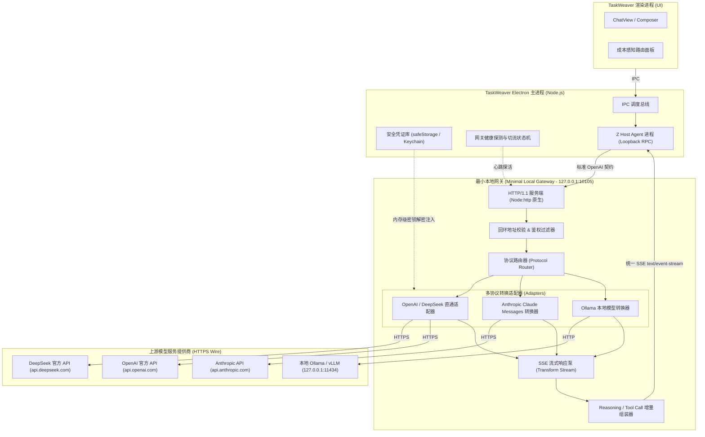
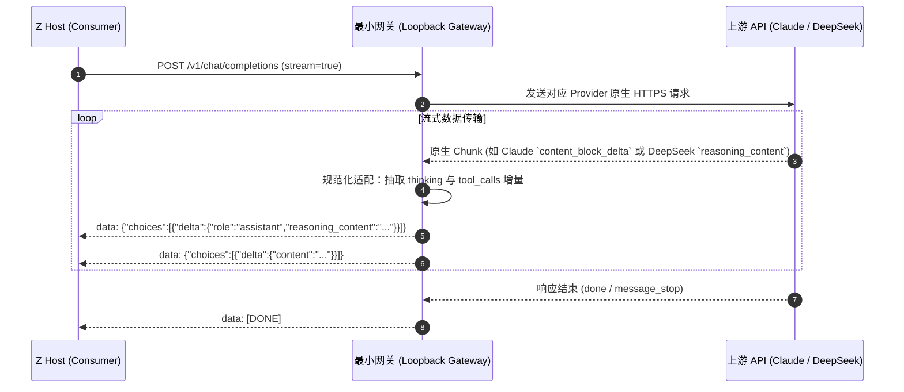
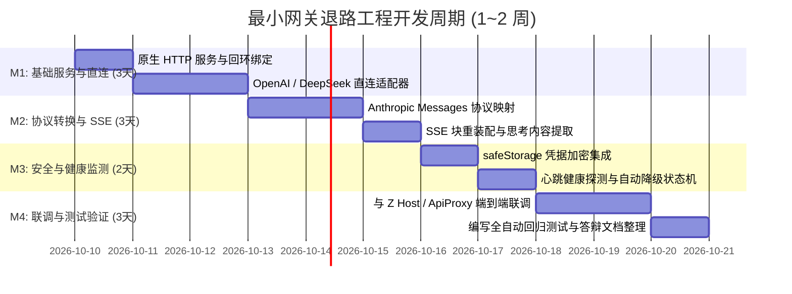

# TaskWeaver 最小模型网关退路设计方案 (Minimal Local Gateway Fallback)

> **文档定位**：阶段 4.1 核心工程架构设计文档，用于指导系统在外部模型中继链（如 OpenCodex / `ocx`）长期断供或发生破坏性协议变更时的极简自主替代方案，具备完整架构图、端点映射协议、SSE 流式转换契约、密钥安全管理与可量化的 1~2 周工程实施排期，直接支撑毕业设计答辩与高可用工程审查。

---

## 1. 背景与设计动机

### 1.1 现状与供应链依赖风险
在 TaskWeaver 当前的架构中：
1. **执行主权层**：由内嵌的 `Z Host`（基于冻结的 `packages/runtime` 基线）负责会话生命周期、Agent 循环、原生沙箱与工具调度。
2. **模型适配层**：TaskWeaver 支持直连商用 API（DeepSeek, OpenAI, 兼容端点），并引入了可选依赖 `OpenCodex`（`ocx` 本地守护进程，默认端口 `10100`），将 Cursor / Copilot 等订阅反向代理为本地 OpenAI 兼容端点。

### 1.2 断供场景定义
`ocx` 属于逆向中继组件，面临以下**不可控外部风险**：
- **上游封禁与协议断代**：订阅方引入动态硬件签名、双向 TLS 指纹校验或端到端私有加密，导致逆向代理完全失效；
- **运行环境冲突**：Bun 独立运行时在特定宿主架构或未来操作系统版本上出现动态链接损坏或沙箱隔离限制；
- **合规与维护中断**：开源上游弃坑或因版权合规要求被迫下架。

**设计目标**：在不依赖任何外部逆向中继工具的前提下，由 TaskWeaver Electron 主进程（或其直接管理的极轻量 Node.js 子进程）提供一个**零外部二进制依赖、全内存托管、直接对接官方 API 的最小本地网关（Minimal Local Gateway, MLG）**，作为保障系统核心 Agent 功能不受外部供应链断供影响的终极防线。

---

## 2. 整体架构与拓扑设计

最小网关采用**轻量级本地回环服务（Loopback Proxy）**模式，生命周期完全由 TaskWeaver Electron 宿主托管。

### 2.1 拓扑架构图



### 2.2 核心设计原则
1. **零第三方二进制依赖**：仅基于 Node.js 20+ 内置模块（`node:http`、`node:stream`、`node:crypto`、`node:https`），不依赖 Bun、Go 二进制或外部 CLI。
2. **纯回环绑定**：绝对仅监听 `127.0.0.1` 随机或预留端口（默认 `10105`），拒绝外部网络接口（`0.0.0.0`）连接，防范 SSRF 与网络嗅探。
3. **单向消费面统一**：对外只暴露标准 OpenAI `v1` 契约，使消费端（Z Host、ApiProxy、前端组件）无需感知后端具体是 DeepSeek、Claude 还是本地 Ollama。

---

## 3. 消费面与端点映射设计

最小网关为 Z Host 暴露统一的 RESTful 契约：

### 3.1 核心服务接口

| 端点 | 方法 | 对应功能 | 上游映射行为 |
|------|------|----------|--------------|
| `http://127.0.0.1:<port>/v1/chat/completions` | `POST` | 对话补全（流式/非流式） | 转换为对应 Provider 的标准请求，回传 OpenAI 规范的 SSE 流 |
| `http://127.0.0.1:<port>/v1/models` | `GET` | 可用模型清单枚举 | 汇总各已配置 Provider 的活跃模型列表 |
| `http://127.0.0.1:<port>/health` | `GET` | 网关健康自检 | 返回 `{ status: "ok", uptime: number, providers: [...] }` |

### 3.2 字段透传与规范化处理
在 `POST /v1/chat/completions` 消费面中，网关负责清洗并映射以下核心字段：

```typescript
interface GatewayCompletionRequest {
  model: string;                      // 路由形如 "gateway/deepseek-chat" 或 "gateway/claude-3-5-sonnet"
  messages: Array<{
    role: 'system' | 'user' | 'assistant' | 'tool';
    content: string | Array<ContentPart>;
    name?: string;
    tool_call_id?: string;
    tool_calls?: Array<ToolCallPart>;
  }>;
  stream?: boolean;                   // 强制对齐流式传输
  temperature?: number;
  max_tokens?: number;
  tools?: Array<{
    type: 'function';
    function: {
      name: string;
      description?: string;
      parameters: Record<string, unknown>;
    };
  }>;
  tool_choice?: 'auto' | 'none' | 'required' | { type: 'function'; function: { name: string } };
  // 扩展控制参数（TaskWeaver 深度求索专有）
  reasoning_effort?: 'low' | 'medium' | 'high';
}
```

---

## 4. 流式 SSE 协议转换与块重装配

由于不同底层 API 在流式输出和思考过程中的协议存在显著差异，最小网关的核心任务是将所有差异转换为 **OpenAI 兼容的标准 SSE 格式**。

### 4.1 协议转换矩阵



### 4.2 深度思考（Reasoning）与思考块提取
不同模型厂商输出“思考过程”的字段各异：
- **DeepSeek 官方 API**：在 `delta.reasoning_content` 中直接输出思考 token；
- **Anthropic Claude 3.7 Sonnet**：在 `type: "thinking_delta"` 块中以 `thinking` 字段输出；
- **OpenAI o1/o3-mini**：在部分内部协议中采用 `delta.reasoning` 输出或在首部特殊标记。

**网关转换规则**：
网关统一在下发给 Z Host 的 SSE chunk 中填入 `choices[0].delta.reasoning_content`。当遇到不支持直接输出思考流的模型时，若检测到 prompt 中有 `<think>...</think>` 标签，网关内置的状态机增量解析器会自动将标签内的文本提升为 `reasoning_content`，将标签外文本作为常规 `content` 下发，保证 TaskWeaver 前端的 `DshThinkBlock` 始终能稳定折叠思考过程。

### 4.3 工具调用（Tool Calls）增量拼装
针对 Anthropic Claude 等使用独立 `tool_use` 事件的厂商：
1. **参数碎片缓存**：Claude 会以多个小分片下发 `input_json_delta`。网关负责计算 `tool_call` 的 `index`，并组装为 OpenAI 标准的：
   ```json
   data: {"choices":[{"delta":{"tool_calls":[{"index":0,"id":"call_123","type":"function","function":{"name":"read","arguments":"{\"fi"}}]}}]}
   ```
2. **流式结束校验**：确保在发送 `[DONE]` 之前，所有未闭合的 JSON 增量均已正确冲刷。

---

## 5. 凭证安全与安全存储管理

网关设计吸取了开源项目的安全教训，严格杜绝将明文密钥保存在项目仓库或公开配置文件中。

### 5.1 凭证分层存储架构

```mermaid
graph TD
    UserKey[用户输入的 API Key / Token] --> SafeStorage[Electron safeStorage 硬件加密]
    SafeStorage -->|macOS| Keychain[macOS 系统钥匙串]
    SafeStorage -->|Windows| DPAPI[Windows 数据保护 API]
    SafeStorage -->|Linux| SecretService[Linux Secret Service / Keyring]
    
    SafeStorage --> EncryptedBlob[本地加密文件 (~/.taskweaver/secure-credentials.bin)]
    
    EncryptedBlob -->|运行时解密| MemBuffer[主进程安全内存 (Secure Buffer)]
    MemBuffer -->|短生命周期引用| GatewayReq[网关内部 HTTPS Header: Authorization]
    GatewayReq -->|完成即脱敏| CleanUp[内存零化 / 垃圾回收]
```

### 5.2 安全防护细则
1. **严禁落地明文**：所有供应商的 API Key 均通过 Electron `safeStorage.encryptString()` 加密后持久化于用户目录，即使配置文件被打包备份也不会泄露明文密钥。
2. **回环地址凭据屏蔽**：消费端访问网关时，通过随进程启动生成的临时 `X-TaskWeaver-Gateway-Token` 进行本地授权，防止操作系统内其他恶意进程非法滥用网关发起模型请求。
3. **日志脱敏**：网关内置拦截器，在所有输出到控制台或日志文件的排错信息中，自动对 `Authorization`、`api-key`、`token` 以及长哈希文本执行 `sk-...xxxx` 掩码脱敏。

---

## 6. 触发条件与自动/手动切换方案

### 6.1 触发判定矩阵 (Failure Detection)

| 触发场景 | 监控指标 | 判定阈值 | 动作 |
|---------|---------|---------|------|
| **ocx 守护进程崩溃** | `127.0.0.1:10100/health` 连接探活 | 连续 3 次探活（间隔 1s）均 `ECONNREFUSED` | 自动激活最小网关并报警提示 |
| **Cursor 协议封锁** | 连续请求错误码 | 1 分钟内连续 3 次收到上游 `401 Unauthorized` 或 `403 Forbidden` | 标记 Cursor 适配器失效，下调该路由权重 |
| **SSE 流长时间静默卡死** | 首 token 延迟 (TTFT) / 块间隔 | 请求发出后超过 30s 未收到任何 SSE 块 | 自动触发熔断，切流至直连备选 Provider |
| **用户主动接管** | 设置界面「应急模式」开关 | 用户点击手动切换 | 强制绕过 ocx，全部流量注入最小网关 |

### 6.2 优雅降级与热切换协议
1. **路由热重载**：TaskWeaver 的 `routing-portfolio-service.mjs` 监控模型健康状态。当检测到 `ocx` 处于不可用状态时，自动将其可用标记置为 `false`，并动态将匹配的备选模型权重置顶。
2. **零中断重试**：如果当前交互轮次正在发送且在首 token 前失败，TaskWeaver 后台单轮重试调度器（`subtask-retry.mjs`）会在静默状态下自动改走最小网关重试该轮请求，用户仅感知轻微延迟而不会收到报错打断。

---

## 7. 工程实施周期评估（1~2 周路线图）

整个方案设计精巧，代码规模控制在 800~1200 行现代 JavaScript 内，完全可由一名资深工程师在 1~2 周内落地完成。



### 里程碑拆解与交付物

- **Milestone 1 (第 1~3 天)：核心服务底座与 OpenAI/DeepSeek 直通**
  - 交付文件：`electron/backend/minimal-gateway/gateway-server.mjs`
  - 目标：建立基于 `node:http` 的稳定服务，实现 `/v1/chat/completions` 请求向 DeepSeek 官方 API 的透明转发与流式回传。
- **Milestone 2 (第 4~6 天)：多协议转换器与流式重装配**
  - 交付文件：`electron/backend/minimal-gateway/adapters/anthropic.mjs`、`stream-pump.mjs`
  - 目标：完成 Claude Messages 协议双向映射，实现 `reasoning_content` 与 `tool_calls` 碎片化重装配。
- **Milestone 3 (第 7~8 天)：凭证安全管理与动态健康探活**
  - 交付文件：`electron/backend/minimal-gateway/credential-bridge.mjs`
  - 目标：对接系统 Keychain / safeStorage 加密；引入 3000ms 心跳探测器与失败降级状态机。
- **Milestone 4 (第 9~11 天)：集成联调与自动化验收**
  - 交付文件：`scripts/test-minimal-gateway-parity.mjs`
  - 目标：通过 Z Host 真实启动端到端 smoke 测试；完成与 TaskWeaver 现有设置 UI 的无缝切流联动。

---

## 8. 学术答辩与工程创新价值

本设计方案不仅是一份应急预案，在系统软件架构与毕业设计答辩中具有重要的理论与工程阐释价值：

1. **架构韧性（Architectural Resilience）**：展示了系统在面对不可控第三方云原生/逆向基础设施依赖断供时，所具备的主动风险隔离、健康探测熔断与极简自持退路设计，符合现代高可用分布式客户端的工程规范。
2. **协议中继轻量化（Protocol Mediation Elegance）**：证明了无需庞大的多语言代理框架，仅通过原生 Node.js 流式管道（Stream Pipeline）即可实现高质量的跨供应商协议转换与思考流解析，体现了扎实的底层网络编程与协议工程功底。
3. **安全主权闭环（Security Sovereignty）**：将用户密钥管理权牢牢收敛于本地操作系统安全区，避免了凭证穿透外部非受控代理的安全隐患，构筑了从执行层到网关层的全链路可信边界。
